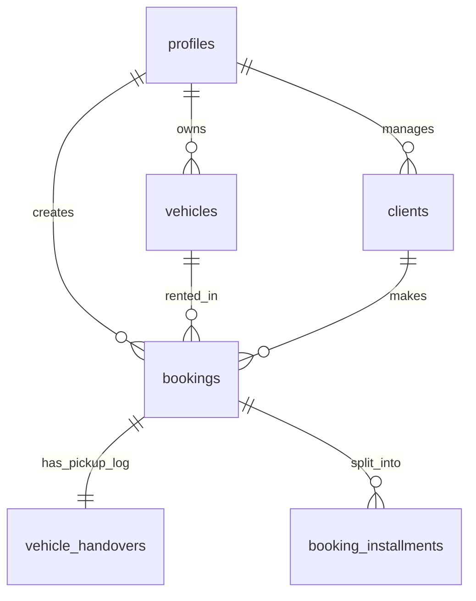

# CRM System Architecture & Database Overview

This document explains how the database is structured and how multitenancy/security is implemented in the CRM system.

---

## 1. CRM Database Tables

The system uses a multitenant PostgreSQL database powered by Supabase. Every entity belongs to a specific owner (tenant) identified by their `owner_id`.

### Table Details
*   **`profiles`**: System users (owners/admins). The owner `elinerentcar@gmail.com` corresponds to the UUID `ffce4379-9630-4c82-8a21-e9445c1f977d`.
*   **`vehicles`**: The fleet of cars owned by the profile. Contains brand, model, year, license plate, current mileage, and status.
*   **`clients`**: Customer profiles in the CRM. Contains client name, phone, CIN, license number, dates of delivery, address, and trust scores.
*   **`bookings`**: Rental contracts. Stores start date, end date, pickup/return times, total amount, deposit paid (`acompte_paid`), and references to `client_id` and `vehicle_id`.
*   **`vehicle_handovers`**: Stores vehicle pickup conditions (pickup mileage, fuel level, cleanliness). It uses `booking_id` as its primary key with a cascade delete relationship.
*   **`booking_installments`**: Stores scheduled tranche payments for bookings where `reste > 0`. If a booking is unpaid or partially paid, the unpaid tranche represents the remaining debt.

---

## 2. Multitenancy & Row-Level Security (RLS)

To prevent data leakage between different RentCar owners, PostgreSQL Row-Level Security (RLS) is enabled on all tables:
*   Any query automatically filters data using `auth.uid() = owner_id` or references.
*   Security rules are defined in [supabase.sql](file:///c:/Users/asus/Desktop/projet/car-dash/supabase.sql).
*   During programmatic batch insertions, we bypass RLS using the Supabase **Service Role Key** so that we can insert records directly on behalf of any owner UUID.

---

## 3. derived Financial Inflows

The system **does not maintain a separate cash flow or transactions table**. All cash flows (rental inflows, revenues) are derived dynamically on read:
1.  **Deposits (Acomptes)**: Derived from `bookings.acompte_paid` (credited on the booking start date or creation date).
2.  **Tranches/Installments**: Derived from `booking_installments` rows. A paid installment is a completed inflow, while an unpaid installment with a due date in the past is marked as overdue.
3.  **Shortfalls**: Calculated dynamically as the difference between `total_amount` and the sum of paid deposits + installments.

This ensures zero-drift financial statistics.
